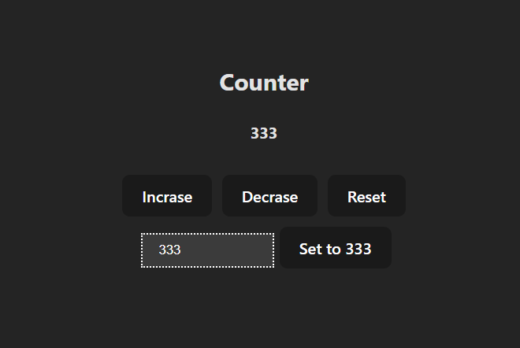

# React Core Principles: Counter Application 🧮

A foundational React application highlighting the core principles of the component rendering lifecycle, robust state updates, and controlled inputs. Built using **React** and **Vite**, this seemingly simple project acts as an essential demonstration of modern functional UI building.



## ✨ Features

- **Dynamic Increment/Decrement**: Seamlessly modify state integers exactly with immediate, reactivity-driven DOM updates.
- **Conditional Guardrails**: UI elements instantly lock or unlock depending on exactly what value the state holds (e.g., the Decrement button completely disables to prevent negative sequences before hitting 0).
- **Custom Value Injection**: Rather than clicking repeatedly, users can input specific numeric strings to instantly override the counter's state via a dedicated injection form.
- **Strict Data Types**: Automatically sanitizes raw string inputs from the DOM into proper `Number` primitives natively before updating the React internal state.

## 💡 Technical Challenges & Learnings

While visually straightforward, this project serves as a crucial technical milestone demonstrating the precise rules of React compared to traditional imperative Vanilla JavaScript. Here are the specific engineering highlights crafted into the logic:

- **Functional State Updates**: When updating a value that strictly relies on its previous state, it's a common beginner pitfall to blindly use direct values like `setCount(count + 1)`. To bypass potential stale closure bugs and React batching issues, I structurally enforced functional updates (`setCount((prev) => prev + 1)`). This mathematically guarantees the callback acts reliably upon the most recently painted state snapshot.
- **Controlled Components & strict Type Safety**: Taking input from an `<input>` tag required binding it securely to its own React `useState`. However, HTML DOM inputs exclusively return `String` types natively, causing catastrophic logic bugs if added mathematically (e.g., `'5' + 1 = '51'`). I intercepted the inline `onChange` event object and forcibly enforced strict type casting via `Number(e.target.value)` to ensure rock-solid numerical integrity.
- **Reactive UI Constraint Logic**: I aggressively leveraged JSX's ability to interpret JavaScript inline to dynamically secure the controls. By tying the Decrement button directly to `disabled={count < 1}`, the application purely relies on exact state evaluation to trigger UI changes—completely eliminating the need for brittle `document.getElementById` and class-toggling methods dominant in Vanilla JS.

These strictly enforced fundamentals cleanly pave the way for expertly managing dense data ingestion and reactive UX states in large-scale applications.

## 🛠️ Tech Stack

- **Frontend**: [React 19](https://react.dev/)
- **Build Tool**: [Vite](https://vitejs.dev/)
- **Styling**: Native CSS

## 🚀 Getting Started

Follow these steps to explore the functional logic locally.

### Prerequisites

Make sure you have Node.js and a package manager (`npm` or `bun` as the project uses a `bun.lock` file) installed.

### Installation

1. Navigate to the project directory:

   ```bash
   cd 01_counter_project
   ```

2. Install the dependencies:

   ```bash
   npm install
   # or
   bun install
   ```

3. Start the development server:

   ```bash
   npm run dev
   # or
   bun run dev
   ```

4. Open your browser and navigate to `http://localhost:5173`.

## 🤝 Contributing

Contributions, issues, and feature requests are highly welcome! Feel free to checkout the codebase and submit a PR if you have ideas on how to elevate this project further.
