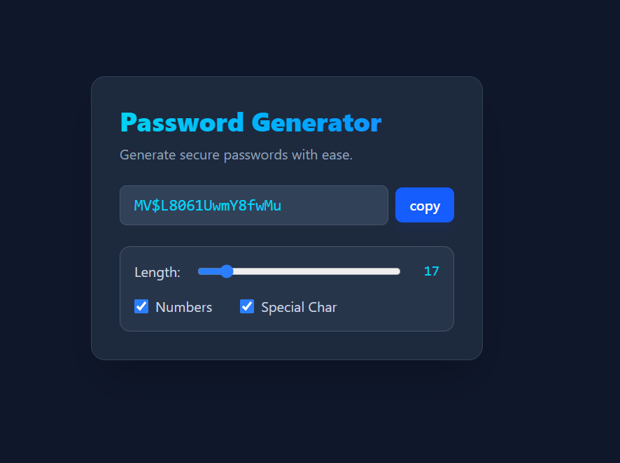

# Secure Password Generator 🔐

A sleek, robust, and user-friendly password generator built with **React**, **Vite**, and **Tailwind CSS**. Easily generate secure passwords tailored to your requirements with one-click copying.



## ✨ Features

- **Customizable Length**: Generate passwords from 6 to 100 characters long.
- **Character Options**: Instantly toggle numbers and special characters to meet various password policies.
- **Real-Time Generation**: Passwords update dynamically in real-time as you tweak the settings.
- **1-Click Copy**: Copy your generated password securely to the clipboard with a single click.
- **Modern UI**: A premium, responsive glassmorphism/dark-themed interface built with Tailwind CSS.

## 💡 Technical Challenges & Learnings

Building this project was a fantastic hands-on opportunity to deepen my understanding of core React concepts, performance optimization, and browser APIs. Here are the key technical challenges I successfully navigated:

- **Memoization & Preventing Stale State**: Ensuring the password generation function always had access to the latest state (like length and toggled characters) without triggering unnecessary re-renders was challenging. I solved this by strategically leveraging the **`useCallback`** hook to memoize the function logic securely.
- **Controlling Side-Effects**: I wanted the password to generate automatically upon the first load, as well as anytime a user changed their preferences. Tying the generator logic to the **`useEffect`** hook without causing infinite rendering loops reinforced my understanding of effect dependency arrays and React's rendering lifecycle.
- **DOM Manipulation & Browser APIs**: Delivering a seamless "Copy to Clipboard" feature meant interacting with the DOM outside of React's typical data flow. I utilized the **`useRef`** hook to maintain a visual selection of the password string while utilizing the modern `window.navigator.clipboard` API to execute the copy action smoothly.

These challenges equipped me with a deeper appreciation for robust state management and polished user experiences in modern Frontend development.

## 🛠️ Tech Stack

- **Frontend**: [React 19](https://react.dev/)
- **Styling**: [Tailwind CSS](https://tailwindcss.com/)
- **Build Tool**: [Vite](https://vitejs.dev/)

## 🚀 Getting Started

Follow these steps to set up and run the project locally.

### Prerequisites
Make sure you have Node.js and a package manager (`npm` or `bun` as the project uses a `bun.lock` file) installed.

### Installation

1. Navigate to the project directory:
   ```bash
   cd passwordGenerator
   ```

2. Install the dependencies:
   ```bash
   npm install
   # or
   bun install
   ```

3. Start the development server:
   ```bash
   npm run dev
   # or
   bun run dev
   ```

4. Open your browser and navigate to `http://localhost:5173`.

## 📂 Key Files

- `src/App.jsx`: Contains the core password generation algorithm, state management, and the UI components.
- `package.json`: Manages the project's dependencies and scripts.

## 🤝 Contributing

Contributions, issues, and feature requests are welcome! Feel free to check out the codebase and submit a PR if you have ideas on how to improve this project.
