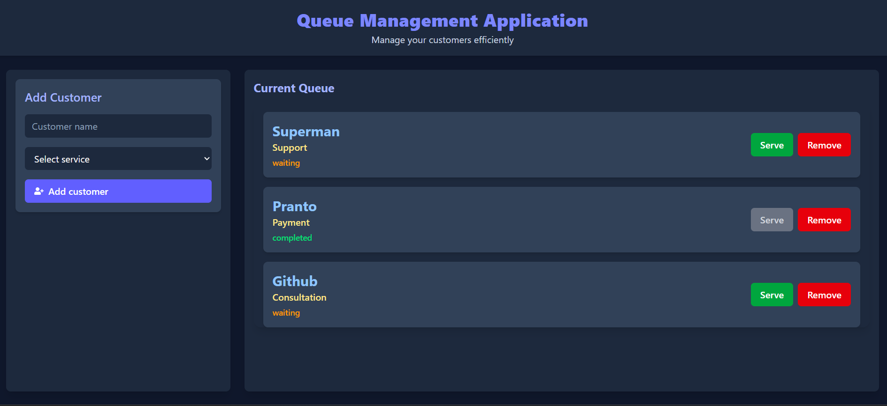
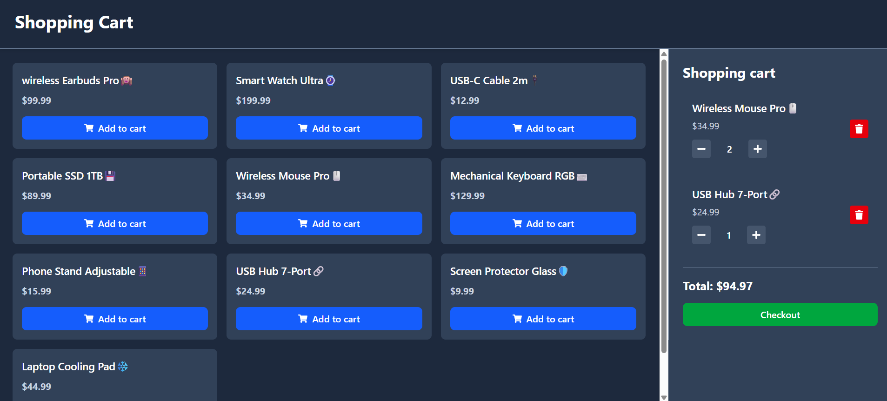
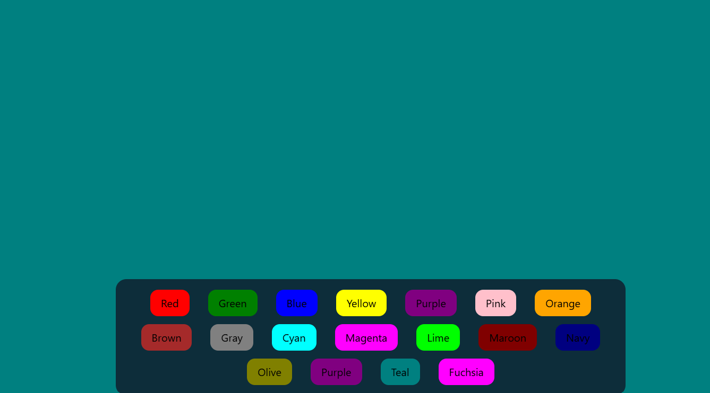

# React.js Project Portfolio

A curated collection of **6 React.js projects** built from scratch, demonstrating proficiency in modern frontend development, state management, performance optimization, and professional software engineering practices. Each project is crafted to solve a real-world problem while showcasing deep understanding of React's core architecture.

---

## About This Repository

This repository is a progressive journey through React.js fundamentals to advanced patterns. Every project includes detailed documentation explaining the **technical challenges faced**, the **engineering decisions made**, and the **concepts mastered** — providing transparent insight into my development process.

---

## Projects Overview

| # | Project | Key Concepts | Tech Stack |
|---|---------|--------------|------------|
| 1 | Counter Application | Functional State Updates, Controlled Components, Type Safety | React 19, Vite, CSS |
| 2 | Queue Management | Unidirectional Data Flow, Immutable Operations, Form Handling | React 19, Vite, Tailwind CSS |
| 3 | Shopping Cart | Custom Hooks, localStorage Persistence, Memoization, Cross-Tab Sync | React 19, Vite, Tailwind CSS |
| 4 | Background Changer | Dynamic Rendering, State-Driven Styling, Data-Driven UI | React 19, Vite, Tailwind CSS |
| 5 | Password Generator | useCallback, useEffect, useRef, Browser APIs | React 19, Vite, Tailwind CSS |
| 6 | Custom React Renderer | DOM Manipulation, Virtual DOM Concepts, Element Creation | Vanilla JavaScript |

---

## Detailed Project Breakdown

### 01 — Counter Application

> A foundational project demonstrating React's core rendering lifecycle and state management.


- **Functional state updates** to prevent stale closure bugs (`setCount(prev => prev + 1)`)
- **Controlled components** with strict type casting (`Number()`) for DOM input sanitization
- **Conditional UI rendering** using JSX inline expressions (`disabled={count < 1}`)

📂 [`View Project`](./01_counter_project)

---

### 02 — Queue Management System

> An interactive customer queue manager showcasing unidirectional architecture and complex state operations.



- **Immutable array operations** using spread syntax, `Array.map()`, and `Array.filter()`
- **Form state management** with controlled components and `.trim()` input sanitization
- **Single Source of Truth** pattern with props passed to modular sibling components
- **Dynamic prop-driven styling** for button states and UI permissions

📂 [`View Project`](./02_queue_management)

---

### 03 — Shopping Cart

> A feature-rich e-commerce simulation with advanced state persistence and performance optimization.



- **Lazy state initialization** for efficient `localStorage` parsing on mount only
- **Cross-tab synchronization** via `window.addEventListener('storage', ...)` with proper cleanup
- **`useMemo`** for memoizing expensive price calculations
- **Custom hooks** (`useCart`) for reusable business logic extraction
- **Immutable nested state updates** for quantity management

📂 [`View Project`](./03_shopping_cart)

---

### 04 — Background Changer

> A dynamic theme manipulation tool demonstrating scalable component architecture.



- **State-driven inline styling** with React as the single source of visual truth
- **Data-driven UI** — buttons generated by mapping over centralized constants (DRY principle)
- **Conditional contrast logic** for automatic text color accessibility
- **Tailwind CSS utilities** for responsive, floating control panels

📂 [`View Project`](./bgChanger)

---

### 05 — Secure Password Generator

> A polished utility application showcasing React hooks and browser API integration.


- **`useCallback`** for memoizing password generation logic
- **`useEffect`** with dependency arrays for auto-generation on preference changes
- **`useRef`** for DOM manipulation (text selection) without re-renders
- **Clipboard API** integration (`navigator.clipboard`) for seamless copy functionality

📂 [`View Project`](./passwordGenerator)

---

### 06 — Custom React Renderer

> A low-level implementation demonstrating how React's element creation and rendering pipeline works under the hood.

- Manual DOM element creation from JavaScript objects
- Prop iteration and attribute binding without a framework
- Understanding of the `createElement` → `render` pipeline

📂 [`View Project`](./my_own_react)

---

## Technical Skills Demonstrated

```
React Fundamentals          Advanced Patterns              Performance
├── JSX & Components        ├── Custom Hooks               ├── useMemo
├── useState                ├── Unidirectional Flow        ├── useCallback
├── useEffect               ├── Lazy Initialization        ├── Memoization
├── useRef                  ├── Immutable Updates           ├── Dependency Arrays
└── Event Handling          └── Cross-Tab Sync              └── Memory Cleanup

Styling & UI                Engineering Practices
├── Tailwind CSS            ├── Clean Component Architecture
├── CSS (Inline & Global)   ├── Separation of Concerns
├── Responsive Design       ├── Input Sanitization
└── Glassmorphism           └── Accessibility (Contrast)
```

---

## Tech Stack

| Category | Technologies |
|----------|-------------|
| **Frontend** | React 19, JavaScript (ES6+) |
| **Build Tool** | Vite |
| **Styling** | Tailwind CSS v4, Native CSS |
| **Icons** | React Icons |
| **Package Manager** | npm, Bun |

---

## Getting Started

Each project is self-contained. To run any project:

```bash
# Clone the repository
git clone https://github.com/Pranto-Paul/the-react-projects.git

# Navigate to any project
cd 03_shopping_cart

# Install dependencies
npm install

# Start development server
npm run dev
```

Open `http://localhost:5173` in your browser.

---

## Why This Portfolio Stands Out

- **Every project has documentation** explaining technical challenges and engineering decisions
- **Progressive complexity** — from basic state management to custom hooks and browser APIs
- **Production-grade patterns** — immutable updates, memoization, memory cleanup, cross-tab sync
- **Real-world relevance** — shopping cart, queue management, password generation
- **Code quality** — DRY principles, separation of concerns, modular architecture

---

## Connect

**GitHub**: [Pranto-Paul](https://github.com/Pranto-Paul)
